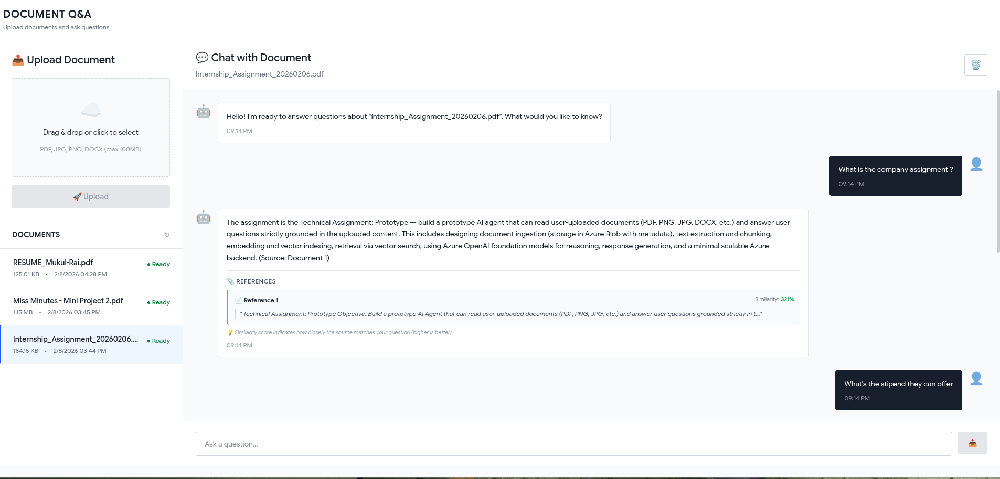
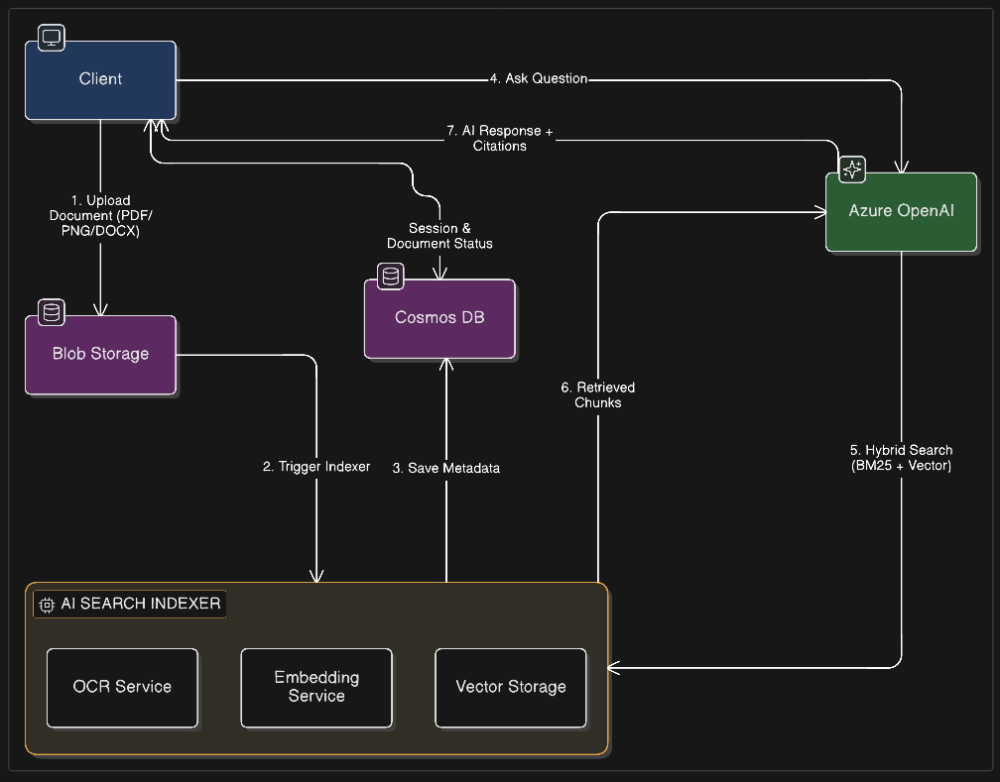

# 📄 Document Q&A Agent

> An intelligent document question-answering system powered by Azure AI services and OpenAI

> A full-stack application that allows users to upload documents (PDF, JPG, PNG, DOCX) and ask questions about them using Azure AI services.

## 🏗️ Architecture

```
                                 ┌─────────────────────┐
                                 │   Blob Storage      │
                                 │                     │
                    Upload ───>  │  Documents Storage  │
                   Document      └──────────┬──────────┘
                                           │
                                    Trigger Function
                                           │
                                           ▼
┌──────────────┐              ┌─────────────────────────┐
│              │              │   AI Search + OCR       │
│    Client    │              │                         │
│   (React)    │              │  • Text Extraction      │◄───┐
│              │              │  • Chunking             │    │
└───────┬──────┘              │  • Embeddings           │    │
        │                     │  • Vector Storage       │    │
        │                     └──────────┬──────────────┘    │
        │                                │                    │
        │ User asks                      │ Fetch from         │
        │ a question                     │ Knowledge Base     │
        │                                │                    │
        │                                ▼                    │
        │                     ┌─────────────────────────┐    │
        └────────────────────>│   Azure OpenAI          │────┘
               │              │                         │
               │              │  • Semantic Search      │
               │              │  • RAG Pipeline         │
               │              │  • Answer Generation    │
               │              │  • GPT-4o-mini          │
               │              └─────────────────────────┘
               │                          │
               │                          │
               └──────────────────────────┘
                    AI Response
```

### Architecture Overview

The system is built on a robust architecture leveraging Azure's cloud capabilities:

**Client Layer:**

- React 18 + TypeScript frontend with Vite
- Session management using localStorage
- Real-time document status tracking
- Interactive chat interface

**Storage & Data:**

- **Azure Blob Storage**: Stores raw document files (PDF, JPG, PNG, DOCX)
- **Azure Cosmos DB**: Stores document metadata, processing status, and session information

**AI Processing Pipeline:**

- **Azure Form Recognizer (OCR)**: Extracts text from documents and images
- **Text Processing**: Chunks documents into manageable segments
- **Azure OpenAI Embeddings**: `text-embedding-ada-002` generates vector embeddings
- **Azure AI Search**: Stores and indexes vector embeddings for semantic search

**Intelligence Layer:**

- **Azure OpenAI gpt-5-mini**: Generates natural language answers
- **RAG (Retrieval Augmented Generation)**: Fetches relevant context from knowledge base
- **Semantic Search**: Finds most relevant document chunks for user queries

### Tech Stack

**Frontend:**

- React 18 + TypeScript
- Axios for API calls
- CSS3 with animations
- Responsive design

**Backend:**

- FastAPI (Python 3.11+)
- Azure Blob Storage
- Azure Cosmos DB
- Azure AI Search (planned)
- Azure OpenAI (planned)

## 🚀 Quick Start

### Backend Setup

1. Navigate to backend:

```bash
cd Backend
```

2. Install dependencies:

```bash
pip install -r requirements.txt
```

3. Configure environment variables in `.env`:

```env
# Azure Storage
AZURE_STORAGE_CONNECTION_STRING=your_connection_string
BLOB_CONTAINER_NAME=documents

# Azure Cosmos DB
COSMOS_ENDPOINT=https://your-cosmos.documents.azure.com:443/
COSMOS_KEY=your_cosmos_key
COSMOS_DATABASE=NextBharat
COSMOS_CONTAINER=Documents
```

4. Run the server:

```bash
python main.py
```

Backend will be available at `http://localhost:8000`

### Frontend Setup

1. Navigate to frontend:

```bash
cd frontend
```

2. Install dependencies:

```bash
npm install
```

3. Configure API URL in `.env`:

```env
REACT_APP_API_URL=http://localhost:8000
```

4. Start development server:

```bash
npm start
```

Frontend will be available at `http://localhost:3000`

---

---

## 📁 Project Structure

```
next_bharat_assignment/
├── Backend/
│   ├── config/              # Azure clients & settings
│   ├── routes/              # API endpoints
│   ├── controllers/         # Request handlers
│   ├── services/            # Business logic
│   ├── models/              # Data models
│   ├── main.py              # FastAPI entry point
│   └── requirements.txt     # Python dependencies
│
├── frontend/src/
│   ├── components/          # React UI components
│   ├── hooks/               # Custom React hooks
│   ├── controllers/         # Business logic
│   ├── api/                 # Backend integration
│   ├── utils/               # Session management
│   ├── types/               # TypeScript types
│   └── App.tsx              # Main component

```

---

## 🔌 API Endpoints

### Backend API

| Method | Endpoint          | Description            |
| ------ | ----------------- | ---------------------- |
| GET    | `/`               | Health check           |
| POST   | `/upload`         | Upload a document      |
| GET    | `/documents`      | List all documents     |
| GET    | `/documents/{id}` | Get document details   |
| POST   | `/ask`            | Ask question (planned) |

## 🎨 Screenshots

### Upload Interface



### Architecture Diagram



## 🔧 Development

### Run Backend in Development Mode

```bash
cd Backend
uvicorn main:app --reload --host 0.0.0.0 --port 8000
```

### Run Frontend in Development Mode

```bash
cd frontend
npm start
```

**Built with ❤️ using Azure, FastAPI, and React**
